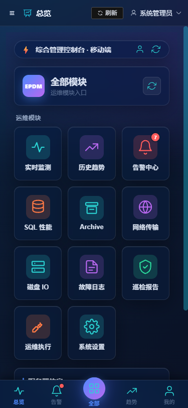
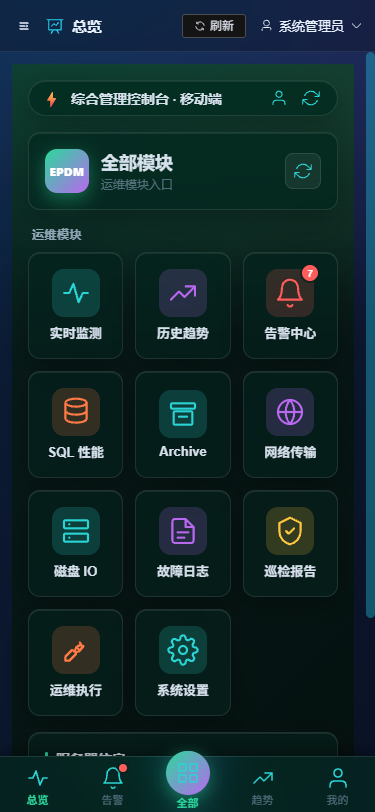
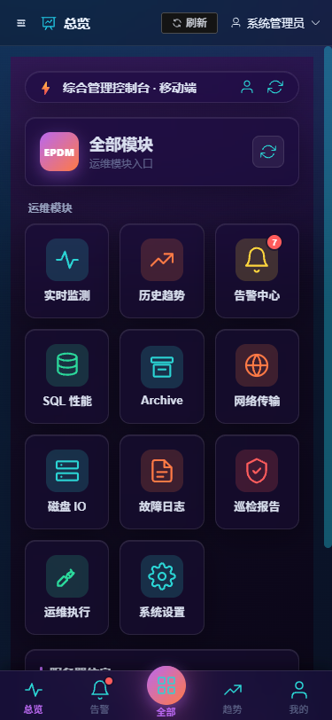
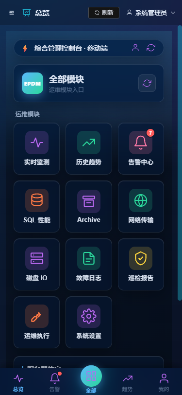
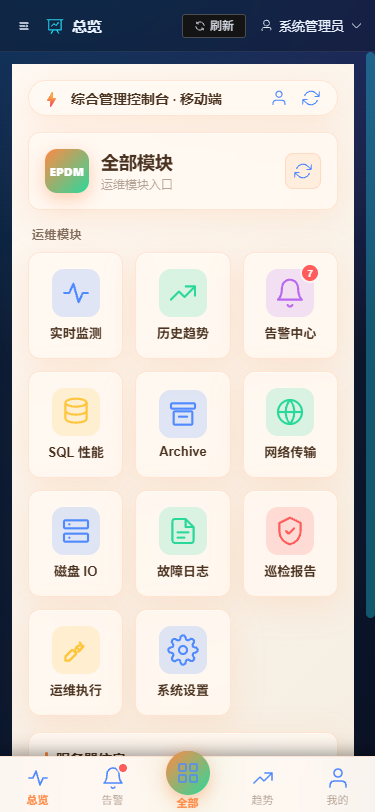
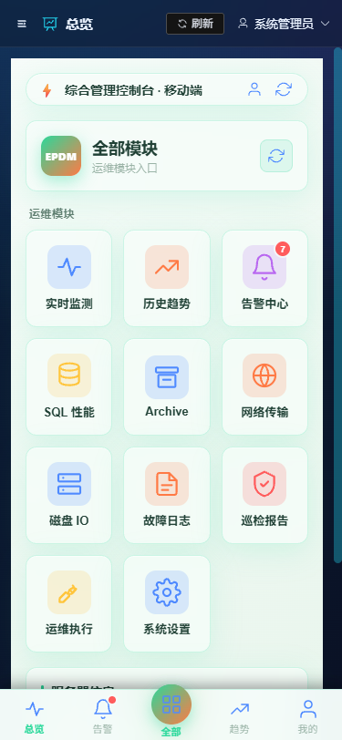
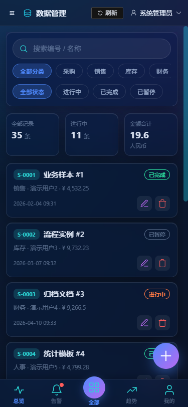
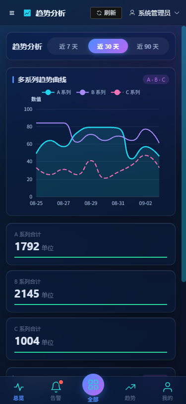

<p align="center">
  <b>Web Console Starter · 多皮肤中后台脚手架</b><br/>
  <span>Vue3 + ElementPlus + ECharts + Express + SQLite · 桌面 4 皮肤 + 手机 H5 独立 6 皮肤</span>
</p>

<p align="center">
  <a href="https://github.com/"></a>
  <a href="LICENSE"></a>
  <a href="https://github.com/"></a>
  
</p>

# wcs-codex-plugins · Codex 插件市场

> 一个能**直接跑、可直接改、可一键打包**的多皮肤中后台脚手架，作为 Codex 插件一键安装。

## ✨ 这个插件能做什么

一套把「Vue3 + ElementPlus + ECharts + Express + SQLite」拼好的**可运行中后台模板**：

- 🎨 **4 套桌面皮肤 + 6 套手机 H5 皮肤**（玻璃视觉 + 底部 TabBar + 设置页即时切换）
- 📱 **5 类示范页面全部"桌面/H5 双形态"**（≤768px 自动切 H5 布局）
- ⚙️ **Express + SQLite 后端底座**（Node ≥22.13 内置 node:sqlite，零原生依赖）
- 🔧 **工程脚本四件套**：脚手架 / 加皮肤 / 命名一致性 / 一键打包
- 📌 做**演示系统**、批量产出多套业务系统的利器

### 手机 H5 界面预览（11 张真机截图）

| 深蓝玻璃（默认·总览） | 墨绿玻璃 | 紫金 | 冰蓝 |
|---|---|---|---|
|  |  |  |  |

| 暖阳浅 | 清新浅 | 数据列表 | 趋势分析 |
|---|---|---|---|
|  |  |  |  |

## 安装（Codex 用户）

```bash
# 一行添加市场
codex plugin marketplace add peihongjun688/wcs-codex-plugins

# 查看 / 安装
codex plugin list                      # 应看到 web-console-starter-full@wcs-codex-plugins
codex plugin add web-console-starter-full
```

装好后 Codex 自动按 description 触发；或在 Codex 里 `/plugins` 查看启停。

## 使用示例

```
用 wcs 模板搭一套多皮肤中后台管理系统
给现有系统加一套暖阳浅皮肤
批量产出三套软件著作权演示系统
```

## 目录结构

```
wcs-codex-plugins/
├── .agents/plugins/
│   └── marketplace.json               # 市场目录（注意是 .agents/plugins/ ！）
└── plugins/
    └── web-console-starter-full/     # 插件本体
        ├── .codex-plugin/plugin.json  # manifest（codex 专属）
        └── skills/
            └── web-console-starter-full/  # SKILL.md + 资源
```

## 做演示系统

脚手架 → 真实运行 → 5 类页面全通 → 一键打包。技能内置命名一致性校验（五处名称同步）、种子数据真实可编辑、报表由真实数据聚合（禁止静态桩），符合软著材料要求。

## License

MIT — 自由使用、修改、再分发。
